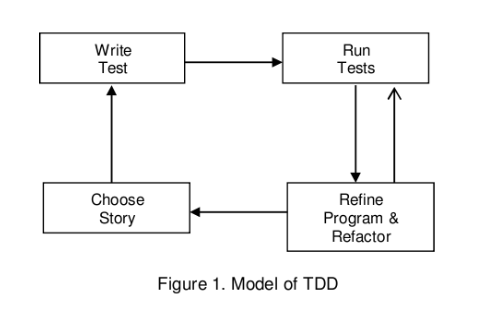

# Science & TDD

## We need to build **predictable** systems.

What's the thing we hate the most about software? Unpredictable behaviour. When developers begin to be surprised by how their software behaves and use some voodoo techniques, troubles start. When technical teams hope that it will work, organisations will think that their developers have lost control. Sometimes, developers know how the system behaves, but they do not understand the exact initial requirement. And, even in these conditions, companies can make revenue and grow. Backoffice report bugs, but no way these tiny bugs replace in the next sprint; this brand new feature that the sales team needs to onboard new clients. After all, the users can use some workaround. That's not a blocker. So, people deal with it until the day where the workaround became the official process that people teach to the new hiree. *It's not a bug. It's a feature*. So, our first duty it's to deliver software that behaves as client **expect**. So we need to use the best methodology to achieve that.

## Two **theories** that make predictions

Let’s take a look at two "theories" trying to make predictions: quantum physics and astrology. I give more trust to quantum physics than astrology. But why do I? It's not because I understand quantum physics (I didn't), or I trust scientists because they're looking serious or they’re wearing a white blouse (most don’t, in fact). I didn’t trust astrology because I think it's not possible that stars’ position in space can affect our lives. Quantum physics told us things way more crazy than that that I’m not sure than my brain is even able to process. I don't know astrology well, but I'm pretty sure that astrology is built around principles that are coherent between them. Even maybe some of this principle could eventually make sense to me. My **intuition **about quantum physics or astrology should not be relevant because I trust one and not the other. 

I trust quantum physic because this theory makes actual predictions, and these predictions are very accurate. The accuracy of this theory has allowed us to build incredible technology that affects my life. When people heard about Heisenberg's uncertainty principle, some thought quantum mechanics is not very reliable. That's the opposite. The theory of quantum mechanics is the science field where the p-value (level of accuracy of studies, lower is better)  is the lower (and from very, very far). On the other hand, astrology didn't perform so well in terms of prediction. Sometimes, that's work. Sometimes not. Like bad software.

## The method

So if we need to build predictable systems, maybe you need to look to which method uses scientists to produce such powerful theories. And stay away from the method of an astrologer, because they didn’t give good results. And by the way, even people that believe in astrology didn't make critical decisions based on this prediction. Most of them will not buy an expensive car because astrology predicts they will earn a lot of money. As developers, we are not scientists, but we should still looking their way of working.  And if we look closely, most of the successful practices raised in the 20 last years are an in some way an adaptation of the scientific method. Most software engineers have followed a scientific formation, and at an early age of the software industry, most of them were scientists or mathematicians. So it was natural for them to use the same kind of methodology for building trustful software. Eg, Peer reviewing is one of the most obvious examples of that. 

## Searching failure

When an astrologer spends time to find confirmation about these successful predictions, the scientist spends his time so search errors in existing theories. And this is the main difference between science and pseudo-science. Science is about to study **falsifiable** statements. E.g., imagine an astrologer told you, "*You will be rich one day*." This statement is not falsifiable. It's literally impossible to produce evidence that will prove to you that this statement is false. First, what it means to be rich? Maybe, some can think that rich is not only about money. And even if it's about money, there is no clear and unambiguous definition of which amount of money you should have to be considered rich (i have everyday evidence of that in political debate). And what about "one day", no explicit limitation in time of the prediction. This statement is not falsifiable. The astrologer takes absolutely no risk by making this statement. And when astrologers are constraint to make falsifiable statements with rigorous protocol, they cannot have salient results. 

If someone told me:  "Every Sunday, it's raining." This statement is maybe wrong, but it's in the domain of science. I need to find a Sunday where it's raining and bring that evidence.   If a scientist formulates a falsifiable hypothesis and, during years, no one can falsify this hypothesis, we can trust this hypothesis.

This notion of falsifiability is something important when it comes to the specification of software. If specifications have room for interpretation, how the client and the developer can agree about a defect is a bug, or a feature. E.g.: A client asks a developer to build an accounting system. The client should not require: "The balance of the account should be accurate." Because this is open for interpretation (especially if the developer is not a domain expert), the client should propose falsifiable statements like: "For a transaction, the sum of the entries should be equal to zero" or "The balance of an account should be the sum of all entries." For proving that the developer did a bad job, the client just needs to find one case where this statement is not right. Behavior Driven Development tried to propose a way of communication between client and developer to reduce the "gap" of understanding. The Given - When - Then terms is an attempt to establish a way to formalise unambiguous scenarios that can be falsified.

## Test-Driven Development

About falsification, the second law of Test- Driven Development:  (*Write no more of a unit test than sufficient to fail) *encourages the developer to propose a not too ambitious falsifiable statement (test) that your system didn't support.  When the non-TDD practitioner tries to confirm that he has done a correct implementation by writing his test after, the TDD practitioner starts by proving the system's deficiencies. Once that done, you are allowed to write the simplest solution to a problem that you have established. In my opinion and a scientific study published in 2003 ( [Test Driven Development and the Scientific Method](https://ieeexplore.ieee.org/document/1231452)), TDD is a kind of translation of the scientific method for software engineer. By quoting Rick Mugride, author of the paper : 

**_S.M. (* scientific method) main elements_*** Theories evolve in large or small steps and must be consistent with experiment results. Experiments examining the pre- dictions of the theory must be repeatable so that the results can be verified and the theory refined.*

**_T.D.D._*** The design of a system corresponds to the theories of S.M, and the tests that are written are the experiments.*

*Tests, like experiments, are repeatable and can be run (and rerun) to test new versions of the design.*

The Test-First approach is a fantastic way to have a substantial safety net against confirmation bias. By writing tests after implementation, a developer is highly influenced by his implementation. So influenced, that sometimes we can find everywhere traces of the implementation in the tests. Implementation details that leaks into tests suits will be a huge problem when you will discover that your implementation wasn’t the good one. You will need to change, your implementation **and your tests. **And finally, your tests will not help you when you seriously need it. They will slow you down. Quiet the opposite of the purpose of unit testing.

## Occam's razor or the law of parsimony

The Occam's razor allows scientists to choose which theory to choose between both to explain something. Maybe the less parsimonious is the good one. But until you prove that the more parsimonious is wrong, you should stick to it. 

  

The third law of TDD is just an adaption of Occam's razor for code: *"You can't write more production code than is sufficient to pass the currently failing unit test."*  That's another great advantage of TDD. he prevents you from falling into the worst plague of Software Engineering: over-engineering. Because it's very complicated to find a relevant test that justified an over-complicated choice, it’s easy to find complex solutions to simple problems. Still, it’ more complicated to find a relevant use case that justified complex design.

## Experiment / Test

As you see in figures from Rick Mugride’s paper, the TDD process is slightly different.  We run our tests more often than scientists run their experiments. Even worst, in each TDD loop, we will run our tests many times. That’s is obvious because the running test is cheap in comparison to running an experiment. It’s so cheap then we decide to industrialize that with **Continuous Integration**. Each time, we want to modify our system, we want to have the guarantee that we run all experiment that we do in the past for being sure that our new system behaves like before regarding the previously defined use cases, and can implement the new use case. Scientists cannot afford this kind of luxury, we are very lucky! Instead of that, the scientific community organise **controversy** through scientific publication to reach a **consensus**. By the way, the COVID-19 situation was an epic demonstration, that mainstream media has not understood at all of how scientists proceed to reach a consensus. Many journalists, editorialists, were shocked when they’re discovered than the scientists didn’t agree on everything. Many even claims that science failed, and sometimes in some talk show, scientists were reprimanded because they weren’t agreed between them and didn’t have a simple answer to journalist’s questions like "Could I go to the beach this summer? ".

## TDD and controversy

To use or to use TDD, is a controversial topic. The [Is TDD Dead?](https://www.youtube.com/watch?v=z9quxZsLcfo)’s episode was a very insightful debate. This kind of peaceful exchange about this bold statement learn me a lot about what TDD was about. I want also to mention the [TDD, where did it all go wrong](https://vimeo.com/68375232)

talk of Ian Cooper, who explains very well how you can produce bad code by using TDD. Even if I believe that TDD is a very healthy coding discipline, you can still produce a horrible thing with it (especially when you are learning, I have myself produce some terrible codes during my first attempts at TDD). Recently, I have watched a talk by Jim Coplien: [What went wrong with the IT-industry?](https://www.youtube.com/watch?v=gPP7Bleg214). During this talk, Jim Coplien is very offensive about TDD that he assimilates it to an irrational belief or a way to just shame people that didn’t use it. To be honest, he makes a lot of relevant points about bad things that developers do when they’re embracing TDD. But Coplien claims very loud that it is academically proven that TDD didn’t work. If’s it’s true, that’s something huge. If science told us that TDD didn’t work (or not perform better? It’s slightly different but still interesting), the whole software community should immediately stop to promote TDD. So, I have started to dig what’s really told us about these studies.

## Meta-analysis

When you want to have a better understanding of scientific consensus, and you don’t have months to read all papers published on a topic, the best thing to do is to look for analysis that compiling multiple papers. A good meta-analysis study will select papers based on the quality of the experimental protocol and will try to extract knowledge from these studies. By doing this, we avoid cherry-picking the paper that fits with our belief and ignores the others. About TDD let’s take a look at [Overview of the Test Driven Development Research Projects and Experiments](https://www.researchgate.net/publication/320634129_Overview_of_the_Test_Driven_Development_Research_Projects_and_Experiments) published in 2012. By the way, this study includes in their analysis the paper that Jim Coplien mention (48 papers are included in this study). In the introductions, authors mention : 

*However, the analyzed projects design and reported results illustrate challenges that every researcher meets when research project designs and reported results are not standardized. Some of the reported conclusions were contradictory to each other. Even the most of presented project on the first look seem to use the same or very similar design when some of the important details are taken in account the picture about project similarities can be radically changed, as well as question how much of the TDD approach is really used can quickly be raised.*

OK, that doesn’t seem as simple as Jim Coplien suggest it. During the paper introduction, the authors explain to us that it’s not possible to make a trustful conclusion from these papers about the efficiency of TDD. There are too many factors of confusion in these studies. That didn’t mean that researchers are bad, but they didn’t have the leverage to set up an experiment where we can isolate the TDD factor from other factors like the experience of the developer, nature of the project, team size. Also, all compiled studies didn’t have exactly the same objective. Eg, the metrics chosen for determining if TDD perform well are not the same between studies. Some studies choose as metric "code reuse". Does it interesting metrics? It’s debatable: sometimes code reuse is needed, sometimes it brings coupling (sometimes coupling is bad, and sometimes you are paid for coupling things together). Other metric chose: number of defects. At first sight, it seems like a relevant metric. But can we just sum up defects and conclude about the software quality? A defect should have a weight-related to the severity. A cosmetic error cannot count as a defect that put your infrastructure down.

So, Jim Coplien makes a very bold statement based on one of these studies (Siniaalto & Abrahamsson, 2007). About this study, in the meta-analysis authors mention :  

*The authors of this study made a list of threats that can jeopardize project results validity (Siniaalto & Abrahamsson, 2007):*

1. * Programming experience,*

2. * Level of project complexity,*

3. * Project size,*

4. * Distribution of the work,*

5. * Use of students as study subjects,*

6. * Non-TDD developers were encouraged to write tests, but were not informed about test
coverage measurement.*

Is it reasonable (and honest?) for making a point to not mention that when you use this kind of studies for backing your belief? Even the authors seem not sure about their conclusion. It’s very ambitious to prove by science this kind of thing. And science is **humble and not bold**, and sometimes science just can conclude: "We don’t know".  But in the process of attempting to prove, we can find interesting fact like: experienced developers are more inclined to use TDD than less experienced. Still not definitive proof, but interesting. Studies learn us that for most developers *transition to TDD mindset is difficult*. Interesting too, maybe TDD’s advocate should find a better way to teach it. The meta-analysis concludes with ideas about new experimental protocols that maybe could eliminate some confusions factors for determining the true impact of TDD.  And for the moment : 

 *Thus, neither hypothesis "TDD is superior over traditional approach" nor vice versa cannot be considered proven. *

## Conclusion

 Does it mean that we should not use TDD and wait that science conclude? No, because we have also no significant proof that the "Test After" method is better. Just, we used to it. To determinate if TDD methodology is better than the traditional methodology. We need alose to define what’s exactly the traditional methodology? If we compare TDD, should we compare with a method where we are building the whole system and once it’s done we’re adding the test? I doubt it, it’s quite incompatible with agile principles. The competing “default” method is not very well defined.

In my opinion, TDD is good, but it’s just not enough. TDD or not, you still need to modelling things, to understand correctly the problem that’s you’re trying to solve, to have knowledge about software design, to know how to deal with data or networking… TDD is certainly not a silver bullet. But, in general, TDD is often a special trigger for the practitioner, that lead him to a better understanding of design. That explains the enthusiasm of TDD practitioner to convert other developers to this practice.  In my personal case, I learn in the same process: TDD and principles of software design. So it’s hard to say if my code is better now because I have learned TDD, or because during my TDD’s learning I started to have a more deep understanding of software design? Also, there is no only way to do TDD. Inside TDD practitioners communicate, most agree about general principles around TDD, but there are some slightly differences of view about some topics. 

Even the definition of what is a unit test is something blurry. Not a scientific protocol, but I have made passed a lot of interviews to developers (I will so at least 30). For each candidate, I ask him/her: "What’s your definition of a unit test?". Most of them (didn’t count exactly but almost 80%) replied something like “a unit test is a code that asserts the behaviour of a function in total isolation of other functions of your system”. Then I asked each candidate “What’s your experience with TDD?” A first interesting thing, the frequency of candidate I interviewed that have some professional experience with TDD increases with time. If the candidate has significant experience with TDD: my next question was: “What kind of difficulties do you experiment with TDD”. Almost all, experienced issue with intensive mocking induced by their definition of a unit test. This issue is not related to TDD (in fact TDD followed as Kent Beck described it should mitigate this problem). 

